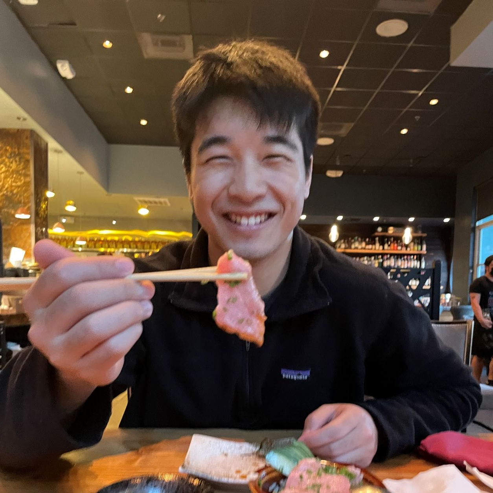

# Welcome!
 

    

 

Hello there! I'm Chuyi, and I recently graduated from UC Berkeley with degrees in Computer Science and Economics. I'm also a Machine Learning Researcher at Berkeley AI Research (BAIR) advised by Trevor Darrell, where I am broadly interested in multimodality and improving model reasoning abilities.

Outside of research, I enjoy cooking, music, history, and browsing through Wikipedia. 

Feel free to reach out to me about anything - I'm more than happy to chat!

 
Otherwise, feel free to check out some of my work below.